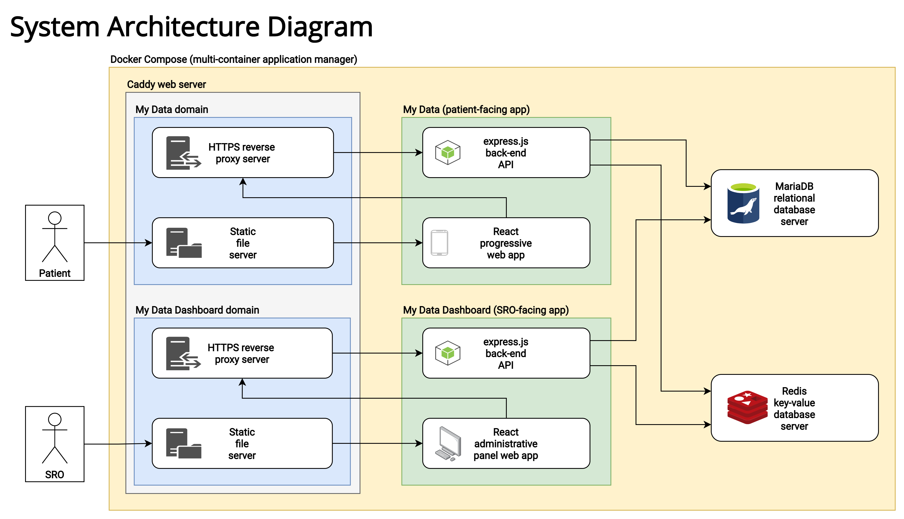

# My Data: a breathlessness data collection and visualisation project

This repository contains [Jeremy Lo Ying Ping](https://jezz.me/)'s _UCL Computer Science_ summer research project, which ran from April to June 2021 and was supervised by Prof Joseph Connor, Prof Dean Mohamedally and Prof Graham Roberts.

The principal aim of the project was to develop a proof-of-concept progressive web app for patients to collect and visualise both speech data -- using an offline, on-device speech recognition model -- and additional self-reported health data, as may be useful for analysing and tracking symptoms of breathlessness. This data may then be shared -- only at patients' behest to ensure they maintain control over their data -- with their associated senior responsible officer to support research.

The hope is that this could provide an ethical way for respiratory disease researchers or doctors to gather invaluable speech and self-reported data from supporting and consenting patients.

## Demo

The app is currently live at [https://mydata.jezz.me/](https://mydata.jezz.me/). There is an anonymous login mode whereby anyone can test out the core functionality of the progressive web app without having been referred by a senior responsible officer of the demo system.

## Metrics gathered

The focus of this project has been to devise a way to gather the following metrics:
- **syllable rate**: a measure of how many syllables are spoken per minute (and a hypothesised potential proxy for breathlessness)
- **word rate**: a (less preferred) measure of how many words are spoken per minute
- **sputum colour**: a 5-point self-reported measure of a patient's [sputum colour](https://www.nbt.nhs.uk/sites/default/files/attachments/COPD%20Rescue%20Pack_NBT002760.pdf)
  - 1 - white
  - 2 - cream
  - 3 - yellow
  - 4 - pale green
  - 5 - green
- **wellbeing**: a self-reported wellbeing rating from 1 (low) to 10 (high)
- **MRC dyspnoea score**: a self-reported measure using the MRC dyspnoea scale
  - 1 - "I am not troubled by breathlessness, except on strenuous exertion."
  - 2 - "I am short of breath when hurrying on the level or walking up a slight hill."
  - 3 - "I have to walk slower than most people on the level and stop after a mile or so (or after 15 minutes) on the level at my own pace."
  - 4 - "I have to stop for breath after walking about 100 yards (or after a few minutes) on the level."
  - 5 - "I am too breathless to leave the house, or breathless after undressing."

**Note**: for the sake of this project, _syllable rate_ has been taken as a better measure of the rate someone is speaking than _word rate_ and has been used as the basis of visualising _speech rate_ and its deviations over time. The phrase "thoroughly thoroughly thoroughly" takes considerably more effort to say than the phrase "two two two", but while the former is 9 syllables and the latter only 3, they are both contain precisely 3 words.

## Project background, research & documentation

Further information beyond this `README` on the project may be found at the following link: [https://jeremylo.github.io/ethical-voice/](https://jeremylo.github.io/ethical-voice/)

### System architecture

The project is formed of the following main components:
- a React-based progressive web app for patients ("the app");
- an Express.js-based API powering the app;
- a React-based dashboard for senior responsible officers to view and manage patient and submission data ("the dashboard");
- an Express.js-based API powering the dashboard;
- a MariaDB database server to store data (important tables are encrypted at rest);
- a Redis server for session token storage; and
- a Caddy server to serve static app and dashboard files, and reverse proxy API requests to their respective APIs.



## Using Docker

All of the different components of the project have been dockerised, spread across several containers:
- `app`: this container outputs an optimised production build of the app into a volume when it is built and ceases to run thereafter
- `api`: this container installs the necessary node modules and then runs the app API
- `dashboard`: this container outputs an optimised production build of the dashboard into a volume when it is built and ceases to run thereafter
- `dashboard-api`: this container installs the necessary node modules and then runs the dashboard API
- `redis`: this container runs the Redis server
- `db`: this container runs the MariaDB server
- `caddy`: this container runs the Caddy web and reverse-proxy server, serving static files from the built app and dashboard volumes on two separate domains and reverse-proxying /api/* requests to their respective APIs
- `adminer`: optionally in development, this container may be started running the database management web tool Adminer

Before the Docker Compose setup is used, please read through the configuration options and provide your own secrets where necessary.

### Deployment using Docker in production

Ensure that both Docker and Docker Compose are installed before proceeding with this section.

Scripts need to be executed as root (or with equivalent permissions) due to a requirement of the `docker-compose` command.

If a script fails to run due to a permission error, set it to the correct permission using the following command (replacing `SCRIPT_TO_UPDATE` with the filename of the script):
```bash
$ chmod +x scripts/SCRIPT_TO_UPDATE
```

#### Building & launching for the first time

To build all the containers necessary for production use and then immediately launch them in detached mode, enter the following command:
```bash
$ docker-compose -f docker-compose.yml -f docker-compose.production.yml up --build -d
```

Alternatively, run the following script as root:
```bash
$ ./scripts/first-build
```

#### Rebuilding and relaunching

To rebuild and relaunch all the containers (say, following an update to the code), enter the following commands in turn:
```bash
$ docker-compose -f docker-compose.yml -f docker-compose.production.yml stop
$ docker-compose -f docker-compose.yml -f docker-compose.production.yml down --rmi local
$ docker volume rm ethical-voice_app-build
$ docker volume rm ethical-voice_dashboard-build
$ docker-compose -f docker-compose.yml -f docker-compose.production.yml up --build -d
```

Removing the volumes is important, otherwise they will not update properly when the containers are rebuilt.

Alternatively, run the following script as root:
```bash
$ ./scripts/rebuild
```

#### Stopping

To stop all containers, run the following command:
```bash
$ docker-compose -f docker-compose.yml -f docker-compose.production.yml stop
```

Alternatively, run the following script as root:
```bash
$ ./scripts/stop
```

### Using Docker in development

For the app, dashboard and their corresponding APIs, it would be preferable to use either the built-in webpack development server or nodemon, which run when `yarn start` is run from their respective directories (even if a configuration to do so has been provided).

Nevertheless, it is useful to use Docker for MariaDB, Redis and Adminer (for inspecting the database during development). You can start these services with the following commands:
```bash
$ docker-compose up -d db
$ docker-compose up -d redis
$ docker-compose up -d adminer
```

## Development

Ensure you have node.js, yarn and Docker installed before you proceed.

After cloning the repository, run `yarn` from each of the following directories to install all of the required packages:
- api
- app
- dashboard
- dashboard-api

Then, ensure that you have properly configured everything as detailed under the 'configuration' section below.

Once that is done, you may start the MariaDB, Redis and optionally Adminer servers.

Finally, for each of the app, dashboard, app API and dashboard API, enter their respective directories and run the following command there:
```bash
$ yarn start
```

You may now continue development as you wish. Any changes you make should automatically update in your browser or automatically restart the node.js server as the case may be.

## Testing

To run the API or dashboard API tests, run the following command from their respective directories:
```bash
$ yarn run test
```

## Deployment with GitHub Actions

A GitHub Action located at `.github/workflows/deploy.yml` has been provided, which will run the commands in `scripts/rebuild` when triggered (except using sudo).

Once docker has been installed, a deployment key has been added to the repository, and `git` properly set up, the `deploy` action may be used to more easily redeploy any changes from the GitHub website.

The GitHub Action expects the following repository secrets to be set:
- `HOST`: the server host
- `USERNAME`: the SSH username
- `PASSWORD`: the SSH password
- `PORT`: the SSH port


## Configuration

### .env file options

The `.env` file is the principal means of configuring the app, dashboard and their respective APIs.

```env
MARIADB_ROOT_PASSWORD=PLEASE_RANDOMISE
MARIADB_USER=PLEASE_RANDOMISE
MARIADB_PASSWORD=PLEASE_RANDOMISE
MARIADB_DATABASE=mydata
MARIADB_HOST=db

BCRYPT_SALT_ROUNDS=14

APP_DOMAIN=mydata.jezz.me
APP_SESSION_COOKIE_NAME=APP_SESSION_ID
APP_REMEMBER_ME_COOKIE_NAME=REMEMBER_ME
APP_COOKIE_SECRET=PLEASE_RANDOMISE

DASHBOARD_DOMAIN=mydatadashboard.jezz.me
DASHBOARD_SESSION_COOKIE_NAME=DASHBOARD_SESSION_ID
DASHBOARD_COOKIE_SECRET=PLEASE_RANDOMISE
DASHBOARD_JWT_SECRET=PLEASE_RANDOMISE

REDIS_HOST=redis
REDIS_PORT=6379
REDIS_PASSWORD=PLEASE_RANDOMISE

SENDGRID_API_KEY="PASTE_YOUR_SENDGRID_API_KEY_HERE"
```

Wherever `PLEASE_RANDOMISE` is listed above, please replace the string with a random string of characters before you run anything for development but especially for production.

- `MARIADB_ROOT_PASSWORD`: the root password of the MariaDB server (<= 79 characters)
- `MARIADB_USER`: the database user the applications should use (<= 79 characters)
- `MARIADB_PASSWORD`: the database password the applications should use (<= 79 characters)
- `MARIADB_DATABASE`: the name of the database (default: mydata)
- `MARIADB_HOST`: the host on which the MariaDB server is running (production: db, development: 127.0.0.1)
- `BCRYPT_SALT_ROUNDS`: the number of Bcrypt salt rounds to use in password hashing (default: 14)
- `APP_DOMAIN`: the domain on which the app is running
- `APP_SESSION_COOKIE_NAME`: the name of the app session cookie
- `APP_REMEMBER_ME_COOKIE_NAME`: the name of the app remember me cookie
- `APP_COOKIE_SECRET`: the secret used to sign all app API cookies
- `DASHBOARD_DOMAIN`: the domain on which the dashboard is running
- `DASHBOARD_SESSION_COOKIE_NAME`: the name of the dashboard session cookie
- `DASHBOARD_COOKIE_SECRET`: the secret used to sign all dashboard API cookies
- `DASHBOARD_JWT_SECRET`: the secret used to sign JSON web tokens generated
- `REDIS_HOST`: the host on which the redis server is running
- `REDIS_PORT`: the port on which the redis server is running
- `REDIS_PASSWORD`: the password the app and dashboard redis user should use
- `SENDGRID_API_KEY`: your own SendGrid API key required to send email


An example production `.env` file is `.env.example.production`. Similarly, an example development `.env` file is `.env.example.development`. Copy the contents of either of these files as best suits your circumstances into `.env` and configure as necessary before you attempt to launch or deploy anything.

### Dashboard development .env file

In development, it may be useful to update the `dashboard/.env` configuration file.

```
PORT=3001
REACT_APP_APP_DOMAIN=mydata.jezz.me
REACT_APP_DASHBOARD_DOMAIN=mydatadashboard.jezz.me
```

- `PORT`: the port on your local machine to which the webpack development server to proxy `/api/` requests
- `REACT_APP_APP_DOMAIN`: the domain on which the app is served
- `REACT_APP_DASHBOARD_DOMAIN`: the domain on which the dashboard is served

### MariaDB keyfile

MariaDB tables potentially containing particularly sensitive data are encrypted at rest. For the database to work properly, a keyfile containing a default 256-bit AES encryption key must be provided, located at `keys/keyfile`.

On Linux systems with OpenSSL installed, such a key may be generated using the following command:
```bash
$ openssl rand -hex 32
```

This key may then be pasted into `keys/keyfile` prefixed with `1;` (to indicate that this key is the default key).

For example, `keys/keyfile` could -- but most definitely in all probability should not -- contain the following:
```
1;aaaaaaaaaaaaaaaaaaaaaaaaaaaaaaaaaaaaaaaaaaaaaaaaaaaaaaaaaaaaaaaa
```

For more information on MariaDB key files, visit the [MariaDB file key management plugin documentation](https://mariadb.com/kb/en/file-key-management-encryption-plugin/).

### Redis users.acl file

In order for Redis to work properly, a `redis/users.acl` must be set properly by replacing `PLEASE_RANDOMISE` below with a random string of characters (smaller than 512 characters in length) to use as a password. There must not be any space between the `>` and the password you wish to set.

```
user apiworker on +@all -DEBUG allkeys >PLEASE_RANDOMISE
```


## Acknowledgements

Special thanks to Mathieu Hu, Laurent Pierron, Emmanuel Vincent and Denis Jouvet at the _Institut national de recherche en sciences et technologies du numérique (Inria)_ for their work on using on-device Kaldi speech recognition models in web assembly, upon which this project builds. Their GitLab repository is available at the following link: [https://gitlab.inria.fr/kaldi.web/kaldi-wasm](https://gitlab.inria.fr/kaldi.web/kaldi-wasm).

More information on their work is included in their conference paper, found at the following link: [https://hal.archives-ouvertes.fr/hal-02910876/document](https://hal.archives-ouvertes.fr/hal-02910876/document).

> Mathieu Hu, Laurent Pierron, Emmanuel Vincent, Denis Jouvet. Kaldi-web: An installation-free,
> on-device speech recognition system. INTERSPEECH 2020 Show & Tell, Oct 2020, Shanghai, China.
> ffhal-02910876f

The Kaldi speech model used in this project is the English model pruned with [KenML](https://kheafield.com/code/kenlm/) used in the `kaldi-wasm` sample project, which was based on the `kaldi-generic-en-tdnn_250` model from the [Zamia Speech project (gooofy/zamia-speech)](https://github.com/gooofy/zamia-speech).

### Package dependencies

#### App

| NPM package | License |
|---------|---------|
| @craco/craco | Apache-2.0 |
| @material-ui/core | MIT |
| @material-ui/icons | MIT |
| @material-ui/lab | MIT |
| @testing-library/jest-dom | MIT |
| @testing-library/react | MIT |
| @testing-library/user-event | MIT |
| file-loader | MIT |
| http-proxy-middleware | MIT |
| idb | ISC |
| jszip | MIT or GPL-3.0 |
| react | MIT |
| react-dom | MIT |
| react-router-dom | MIT |
| react-scripts | MIT |
| react-use-precision-timer | MIT |
| recordrtc | MIT |
| syllable | MIT |
| victory | MIT |
| web-vitals | Apache-2.0 |
| workbox-background-sync | MIT |
| workbox-broadcast-update | MIT |
| workbox-cacheable-response | MIT |
| workbox-core | MIT |
| workbox-expiration | MIT |
| workbox-google-analytics | MIT |
| workbox-navigation-preload | MIT |
| workbox-precaching | MIT |
| workbox-range-requests | MIT |
| workbox-routing | MIT |
| workbox-strategies | MIT |
| workbox-streams | MIT |
| worker-loader | MIT |

#### API

| NPM package | License |
|---------|---------|
| @sendgrid/mail | MIT |
| bcrypt | MIT |
| connect-redis | MIT |
| cookie-parser | MIT |
| dotenv | BSD-2-Clause |
| express | MIT |
| express-session | MIT |
| jsonwebtoken | MIT |
| mariadb | LGPL-2.1-or-later |
| multer | MIT |
| passport-local | MIT |
| passport-remember-me | MIT |
| redis | MIT |
| *Development dependencies* |  |
| jest | MIT |
| superagent | MIT |
| supertest | MIT |

#### Dashboard

| NPM package | License |
|---------|---------|
| @material-ui/core | MIT |
| @material-ui/data-grid | MIT |
| @material-ui/icons | MIT |
| @material-ui/lab | MIT |
| @material-ui/styles | MIT |
| @testing-library/jest-dom | MIT |
| @testing-library/react | MIT |
| @testing-library/user-event | MIT |
| http-proxy-middleware | MIT |
| react | MIT |
| react-dom | MIT |
| react-router-dom | MIT |
| react-scripts | MIT |
| simple-statistics | ISC |
| victory | MIT |
| web-vitals | Apache-2.0 |

#### Dashboard API

| Package | License |
|---------|---------|
| @sendgrid/mail | MIT |
| adm-zip | MIT |
| bcrypt | MIT |
| connect-redis | MIT |
| cookie-parser | MIT |
| dotenv | BSD-2-Clause |
| express | MIT |
| express-session | MIT |
| jsonwebtoken | MIT |
| mariadb | LGPL-2.1-or-later |
| passport-local | MIT |
| redis | MIT |
| *Development dependencies* |  |
| jest | MIT |
| superagent | MIT |
| supertest | MIT |


## License

The files in this repository are licensed under the GNU Affero General Public License (version 3). See the full license in the `LICENSE` file.
