# My Data: a breathlessness data collection and visualisation project
## Project background

This is the extended documentation for [Jeremy Lo Ying Ping](https://jezz.me/)'s _UCL Computer Science_ summer research project, which ran from June to August 2021 and was supervised by Prof Joseph Connor, Prof Dean Mohamedally and Prof Graham Roberts.

The principal aim of the project was to develop a proof-of-concept progressive web app for patients to collect and visualise both speech data -- using an offline, on-device speech recognition model -- and additional self-reported health data, as may be useful for analysing and tracking symptoms of breathlessness. This data may then be shared -- only at patients' behest to ensure they maintain control over their data -- with their associated senior responsible officer to support research.

The hope is that this could provide a more ethical framework for respiratory disease researchers or clinicians to gather invaluable speech and self-reported data from consenting patients.

## Demo

The app is currently live at [https://mydata.jezz.me/](https://mydata.jezz.me/). There is an anonymous login mode whereby anyone can test out the core functionality of the progressive web app without having been referred by a senior responsible officer of the demo system.

## Showcase
### App

#### Home (visualisation overview) and results pages

**Note**: in the graph below, I was testing the app in quick succession, whereas real-world data is more likely to be spread out over time.

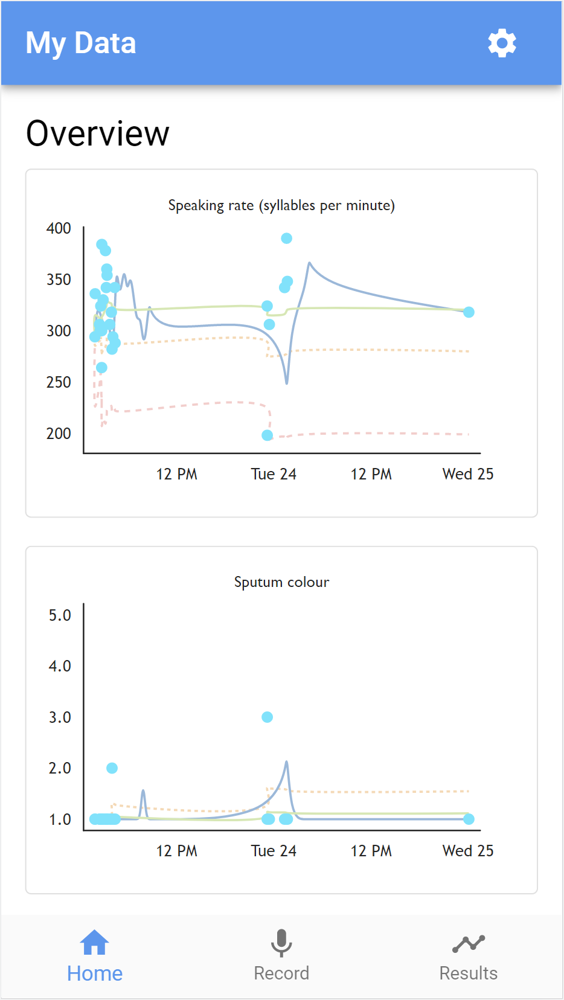
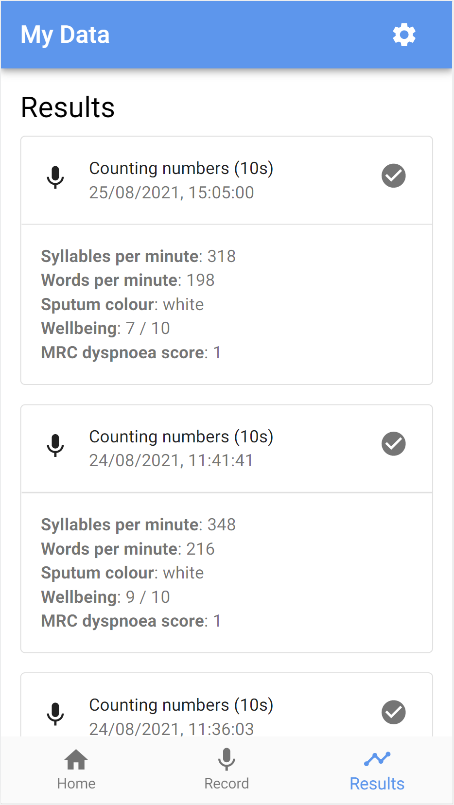

#### Creating a new submission

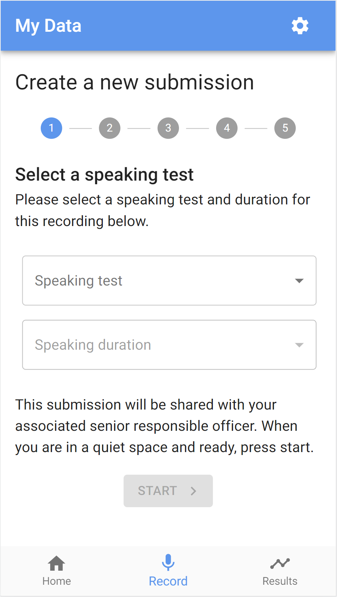
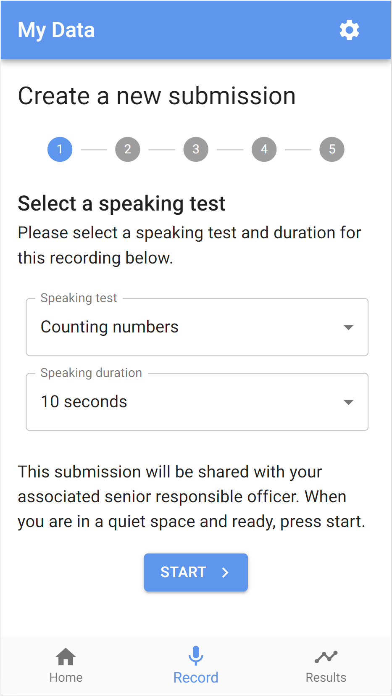
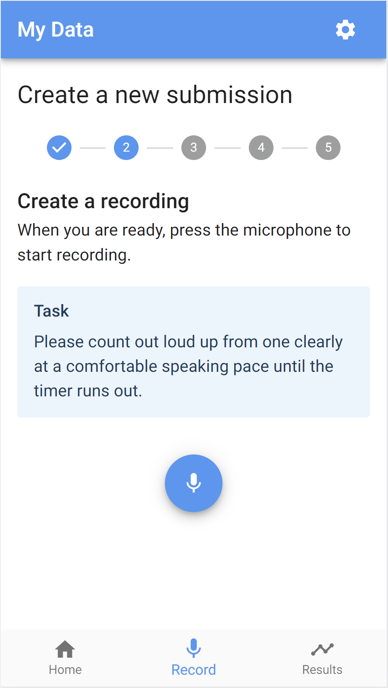
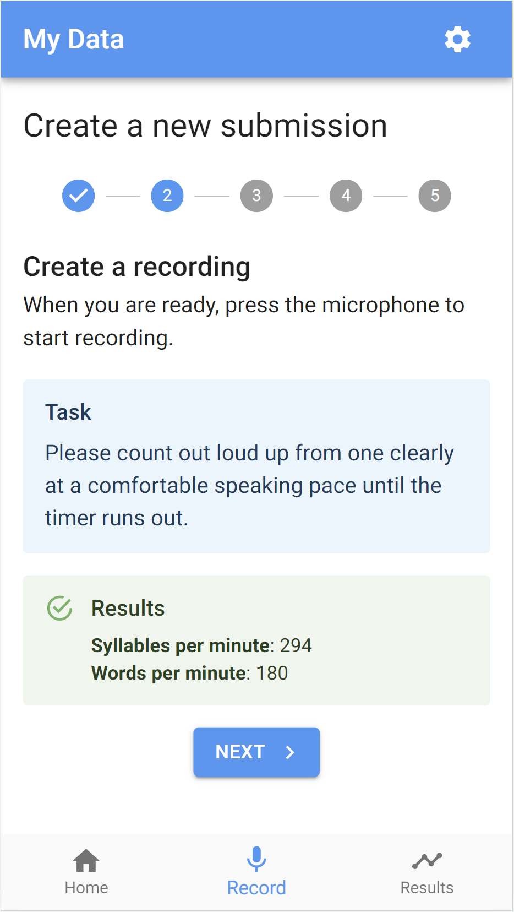
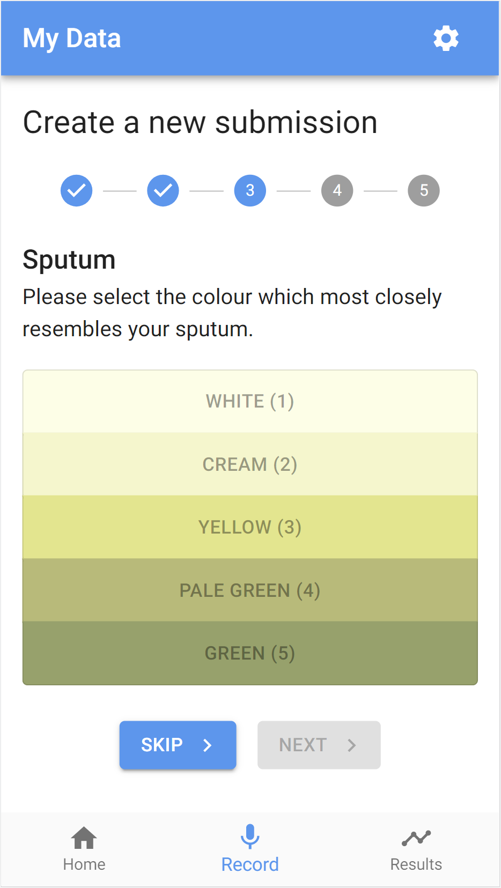
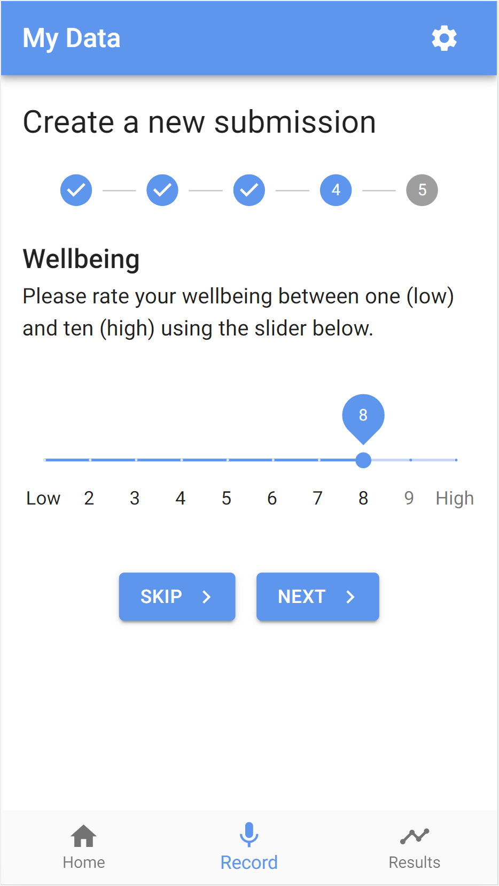
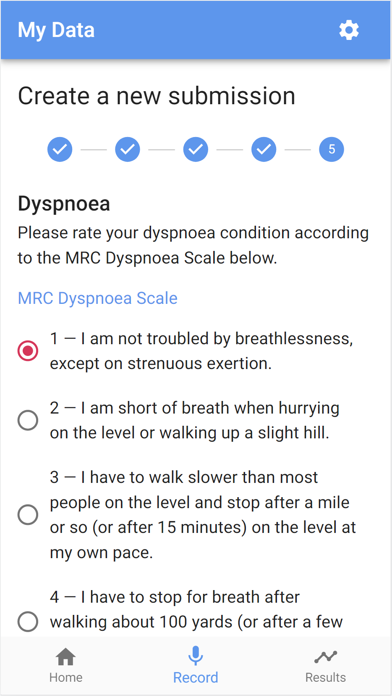
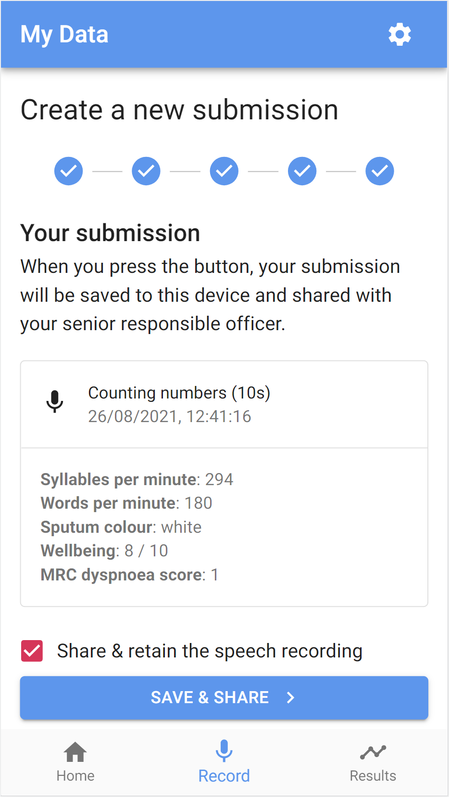

#### Settings

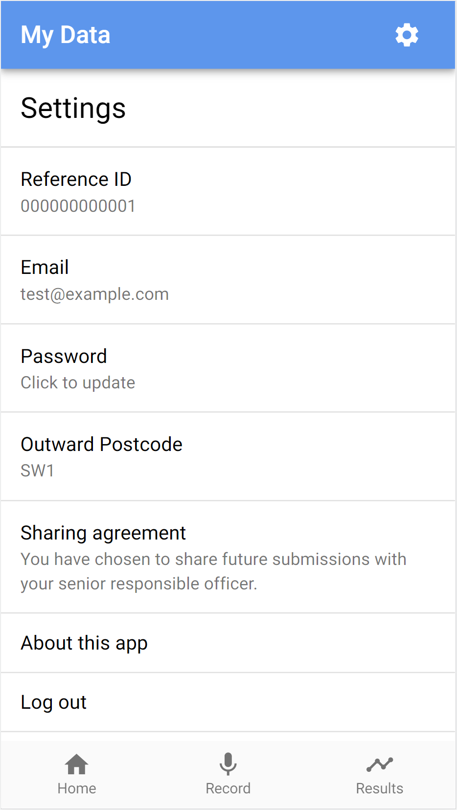

#### Login, registration, activation and account recovery

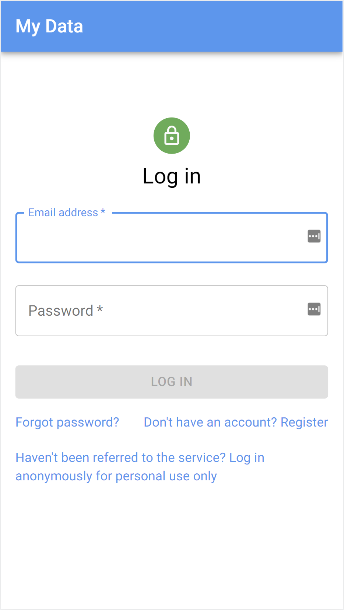
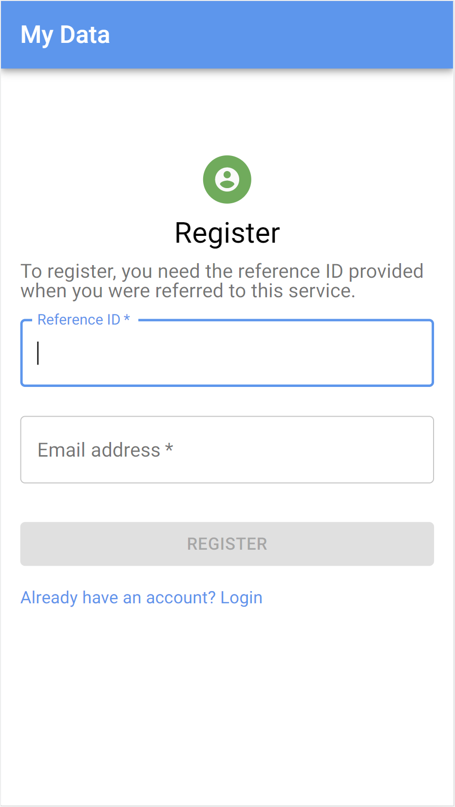
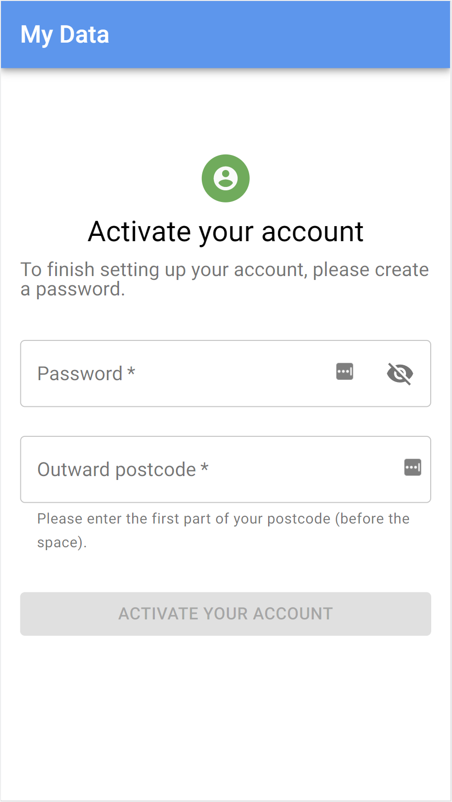
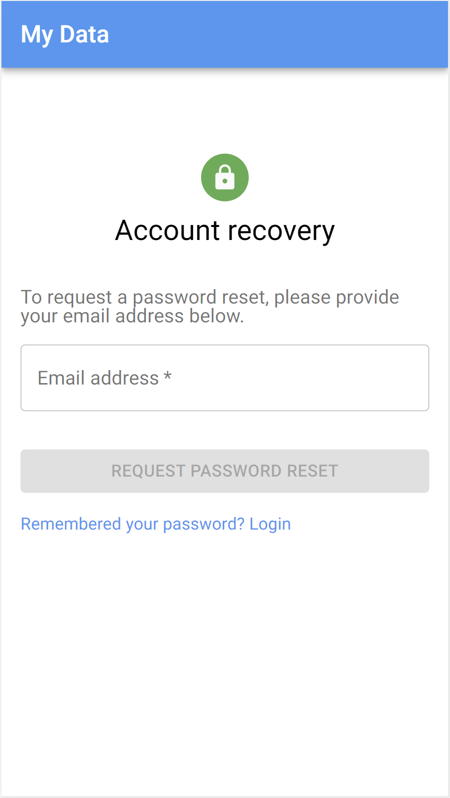

## Research
### Measures of utterance fluency

_While tangiential to the project, I have included this section out of my own interest and for the benefit of any interested readers._

> **Terminology**
>
> *syllable*: an organisational unit of a sequence of speech sounds, from which words are formed, e.g. the word 'computer' is formed from three syllables (`com-pu-ter`).
>
> *pause*: a momentary silent gap in someone's speech
>
> *duration*: the duration for which someone speaks
>
> *phonation time* or *speaking time*: the duration, excluding any silent pauses

It stands to reason that patients who experience greater degrees of breathlessness may find speaking more difficult, so it would be interesting to collect some data to test this hypothesis.

There are several different aspects to fluency [1]:
- **cognitive fluency** -- the ease of converting thoughts from cognitive processes into speech
- **perceived fluency** -- a _listener's_ subjective impression of someone's cognitive fluency
- **utterance fluency** -- the aspects of fluency that are objectively measurable acoustically, such as speed and pausing

For this project, I am most concerned with utterance fluency (although there is certainly some overlap between the categories).

**Note**: it is generally preferable to consider _syllables_ rather than whole _words_ when trying to evaluate how fast someone is speaking. As an example, the phrase "thoroughly thoroughly thoroughly" takes considerably more effort to say than the phrase "two two two", but while the former is 9 syllables and the latter only 3, they are both contain precisely 3 words.

In their investigation of fluency in long-term second-language speakers of English, Lahmann, Steinkrauss and Schmid used the speech analysis software Praat to calculate the following measures [2] of **speed fluency** (related to the speed at which one speaks):
- **speech rate**: number of syllables divided by the duration
- **articulation rate**: number of syllables divided by phonation time
- **average syllable duration** (ASD): phonation time divided by the number of syllables (the reciprocal of articulation rate)

Here, they defined a pause as lasting a minimum of 250ms for the purposes of calculating phonation time. This was also the definition used in _Jong et al_ [3].

Speed is not the only characteristic of fluency; linguists also study **breakdown fluency** (related to pauses that interrupt the flow of speech) and **repair fluency** (related to hesitation and corrective reformulations speakers make as they speak) [1]. Examples of these measures include the following:
- *Breakdown fluency*
  - **Mean pause duration**: the total duration of pauses divided by the number of pauses
  - **Mean pause rate**: the mean number of pauses over a given time period
- *Repair fluency*
  - **Mean rate of repair measures**: the mean number of repetitions whether complete or partial, hesitations, false starts, reformulations and so on over a given time period (some authors use the phonation time rather than the total duration for this [4])
  - **Mean rate of filled pauses**: i.e. time spent saying "ummm" or "uhhh" over a given time period (some authors use the phonation time rather than the total duration for this [4])

Furthermore, there are also composite measures that combine elements of all three characteristics of utterance fluency outlined above, e.g.
- **Mean length of runs**: the mean number of syllables between pauses
- **Phonation time ratio**: the phonation time as a proportion of the total duration

**Side-note**: in dialogues, measures such as the number of turns, pauses between turns and interruptions, as well as conversational overlap may be studied as well!

For my project, considering the limitations of the low-power mobile devices upon which my progressive web app is expected to run, my priority will be to measure speech rate (number of syllables divided by the duration); however, I would love to see articulation rate and a measure of breakdown fluency, such as mean pause rate as defined above, implemented in the future!

#### References

- [1] P. Tavakoli, “Fluency in monologic and dialogic task performance: Challenges in defining and measuring L2 fluency,” International Review of Applied Linguistics in Language Teaching, vol. 54, no. 2, pp. 133-150, 2016.

- [2] C. Lahmann, R. Steinkrauss and M. Schmid, “Speed, breakdown, and repair: An investigation of fluency in long-term second-language speakers of English,” International Journal of Bilingualism, vol. 15, 2015.

- [3] N. H. de Jong, M. P. Steinel, A. F. Florijn, R. Schoonen, and J. H. Hulstijn, “FACETS OF SPEAKING PROFICIENCY,” Studies in Second Language Acquisition, vol. 34, no. 1, pp. 5–34, 2012.

- [4] N. H. d. Jong, “LANGSNAP Workshop: Analysis of fluency,” 10 April 2013. [Online]. Available: [http://langsnap.soton.ac.uk/linked_files/LANGSNAP_dejong.pdf](http://langsnap.soton.ac.uk/linked_files/LANGSNAP_dejong.pdf). [Accessed 24 August 2021].

### Comparison of on-device speech recognition models

As part of my project, I considered several different speech recognition libraries, among which were the following:
- [PocketSphinx.js](https://syl22-00.github.io/pocketsphinx.js/): a JavaScript version of just the speech recognition capabilities of PocketSphinx, a lighter version of the popular CMU Sphinx toolkit for mobile devices
- [Vosk](https://github.com/alphacep/vosk-api): a successor in many ways to PocketSphinx (non-JS) that for the most part uses Kaldi under the hood
- [Mozilla DeepSpeech for Flutter](https://github.com/ManuSekhon/mozilla-deepspeech-flutter): I have used Mozilla DeepSpeech in a previous project ([IBM FISE v2 AskBob](http://students.cs.ucl.ac.uk/2020/group39/)) and discovered while there is not a version that works in-browser, there is a Flutter binding!
- [Kaldi](https://github.com/kaldi-asr/kaldi): a popular speech recognition toolkit written in C++
  - [Kaldi.js](https://github.com/adrianbg/kaldi.js): a version of Kaldi modified to compile to web assembly (unfortunately, the project now seems abandoned)
  - [kaldi-wasm](https://gitlab.inria.fr/kaldi.web/kaldi-wasm): an active project building Kaldi to web assembly that was recently demoed at [INTERSPEECH 2020](https://hal.archives-ouvertes.fr/hal-02910876/document)

#### PocketSphinx.js

To summarise my thoughts, based off the performance of the pre-trained model of _PocketSphinx.js_ used in the demo, while the provided model was lightweight and fairly decent at spotting single, specific keywords, it was not sufficiently accurate -- even just to count the digits zero to nine as in the demo -- for my use case.

There were scenarios where I would count from zero to nine and the numbers would appear in a pseudorandom-seeming order; however, this could also be a function of my (reasonably mild but pronounced) Lancashire accent!

Ideally, it would support a larger lexicon with some level of greater accuracy so that I could garner a measure of word or syllable rate. Nevertheless, I did appreciate that it supports swapping out different finite state grammars in JavaScript at runtime, so it would be possible to tab out my own words in its phonetic representation, which would then be recognised (so far as possible) by the model.

### Vosk

Many of the collaborators who worked on PocketSphinx have gone on to work on a new, more modern speech recognition toolkit called Vosk. It certainly looks promising and I look forward to seeing where it goes!

While it does have early-days support for Python, Java, Node.JS, C# and C++, among other platforms, unfortunately, it does not currently either run in-browser or have a Flutter integration, whereas I would prefer a more cross-platform solution.

Vosk uses Kaldi internally, so I shifted my attention to seeing whether Kaldi may be usable directly in my project.

#### Mozilla DeepSpeech

As previously alluded to, I had a good experience using Mozilla DeepSpeech in [IBM FISE v2 AskBob (repo)](https://github.com/UCL-COMP0016-2020-Team-39/AskBob) on low-power Windows and Linux desktop devices as part of a voice assistant project. I was therefore pleased to discover that there is a pre-existing [Flutter binding for Mozilla DeepSpeech 0.9.3](https://github.com/ManuSekhon/mozilla-deepspeech-flutter).

One downside, however, is the size of the models: while there is a TFLite model (46MiB) already reduced in size compared to the standard PBMM model (184MiB), a significantly larger external scorer (931MiB) -- although optional -- is needed to improve accuracy to what I found to be useful in my tests.

#### Kaldi in WASM

Finally, I was very pleased to discover the work of a group of researchers at Inria to [compile Kaldi to web assembly](https://gitlab.inria.fr/kaldi.web/kaldi-wasm) so that it may be used in-browser. They had successfully pruned the `kaldi-generic-en-tdnn_250` English Kaldi speech model from the [Zamia Speech project (gooofy/zamia-speech)](https://github.com/gooofy/zamia-speech) using [KenML](https://kheafield.com/code/kenlm/) down from 108MiB to a more reasonable 66MiB, which brings it in the realm of possibly being used within a progressive web app.

In testing, I found that the accuracy was significantly better than that of PocketSphinx.js, not least for a much wider vocabulary. At first glance, it seemed comparable to the performance I had previously achieved with Mozilla DeepSpeech and its much larger model and external scorer, despite only having a model size of 66MiB.

As a result, I decided to explore building upon this use of Kaldi with web assembly for this project. Rather than building a native app, or using a cross-platform technology like Flutter, I would be able to make a progressive web app instead, which would allow everything to run in-browser on patients' mobile devices, no installation required.

Progressive web apps certainly do have their disadvantages, particularly related to the maturity of web APIs (e.g. for scheduled notifications, audio and so on) and the difficulty of long-term storage; however, the ease of installation (i.e. none beyond adding the app to the homescreen) and much wider pool of devices that it could support (including being compatible with desktop devices as well) -- when coupled with my increased familiarity with JavaScript -- persuaded me in its favour.

Moreover, more intensive tasks could be offloaded to web workers (potentially further leveraging web assembly) to achieve performance closer to that of a native app, and creating a web app would leave open the possibility of using [Tensorflow.js](https://www.tensorflow.org/js) for training and inference, depending on the future direction of the project!

## System architecture design

The project is formed of the following main components:
- a React-based progressive web app for patients ("the app");
- an Express.js-based API powering the app;
- a React-based dashboard for senior responsible officers to view and manage patient and submission data ("the dashboard");
- an Express.js-based API powering the dashboard;
- a MariaDB database server to store data (important tables are encrypted at rest);
- a Redis server for session token storage; and
- a Caddy server to serve static app and dashboard files, and reverse proxy API requests to their respective APIs.

In the diagram below, "SRO" refers to a senior responsible officer, who receives submissions from their associated patients (the users of the app).


## Metrics gathered

The focus of this project has been to devise a way to gather the following metrics:
- **syllable rate**: a measure of how many syllables are spoken per minute (and a hypothesised potential proxy for breathlessness)
- **word rate**: a (less preferred) measure of how many words are spoken per minute
- **sputum colour**: a 5-point self-reported measure of a patient's [sputum colour](https://www.nbt.nhs.uk/sites/default/files/attachments/COPD%20Rescue%20Pack_NBT002760.pdf)
  - 1 - white
  - 2 - cream
  - 3 - yellow
  - 4 - pale green
  - 5 - green
- **wellbeing**: a self-reported wellbeing rating from 1 (low) to 10 (high)
- **MRC dyspnoea score**: a self-reported measure using the MRC dyspnoea scale
  - 1 - "I am not troubled by breathlessness, except on strenuous exertion."
  - 2 - "I am short of breath when hurrying on the level or walking up a slight hill."
  - 3 - "I have to walk slower than most people on the level and stop after a mile or so (or after 15 minutes) on the level at my own pace."
  - 4 - "I have to stop for breath after walking about 100 yards (or after a few minutes) on the level."
  - 5 - "I am too breathless to leave the house, or breathless after undressing."

## Implementation

A few notable implementation aspects or features are summarised below.

### App speech processing & syllable rate calculations

I have structured the majority of the speech recording and transcription code within a class called the [SpeechService](https://github.com/jeremylo/ethical-voice/blob/main/app/src/services/speech/SpeechService.js). It uses [RecordRTC](https://github.com/muaz-khan/RecordRTC) to record a 16kHz 16-bit signed integer PCM .WAV file, which is then converted into an audio buffer (in the main thread) and passed onto [kaldi-wasm](https://gitlab.inria.fr/kaldi.web/kaldi-wasm) running the web assembly code in a web worker.

Results are calculated in [calculateResults.js](https://github.com/jeremylo/ethical-voice/blob/main/app/src/services/speech/calculateResults.js) using the transcription of the audio and the duration of the speaking test. The [syllable](https://www.npmjs.com/package/syllable) NPM module is used estimate the number of syllables forming each spoken word.

### Submission storage

#### Within the app

Within the app, submissions are stored within a per-user IndexedDB database, wherein audio files are stored as binary large objects (BLOBs) alongside the rest of the submission metdata.

### On the server

Submission audio files are stored as binary large objects (BLOBs, specifically of the `MEDIUMBLOB` type) within the `submissions` table of the MariaDB database (where they may be `NULL` should the patient have declined to attach the audio to their submission) in rows alongside data tied to each submission, such as the user's ID, outward postcode and submission creation time. Submission metadata, such as speech rate and duration, are stored in a separate table. This data is encrypted at rest.

Submission audio files may be listened to directly in the dashboard or included within a ZIP file export of the submission data received from patients associated with a given senior responsible officer.

### App & dashboard data visualisations

Submission results are visualised using the charting and data visualisation library, [Victory by Formidable](https://formidable.com/open-source/victory/). The specific visualisations in question are explained in further detail in the next section.

### User accounts

#### App sessions

Users login through session-based authentication with a remember-me cookie set to act essentially as a refresh token. Given one of the key features of the app is its ability to share the data at patients' behests with their associated senior responsible officers, it was judged that for this project, session-based authentication would suffice, rather than going a full offline-first approach.

Nevertheless, in a future iteration of this app, this would be possible through a modification to the [authenticator.js](https://github.com/jeremylo/ethical-voice/blob/main/app/src/auth/authenticator.js) file and potentially some additional logic in the [service worker](https://github.com/jeremylo/ethical-voice/blob/main/app/src/service-worker.js) to handle requests that fail due to the device being offline. This is likely to be more feasible when the background sync API is more widely supported across mobile browsers.

#### Dashboard sessions

SROs login using session-based authentication; however, no remember-me functionality is present to restrict access to potentially sensitive patient data to only those who definitely have the correct credentials.

#### Use of JSON web tokens

JSON web tokens (JWTs) are used for email confirmation and password reset tokens with a twist: a SHA256 hash of the user's old email or old password Bcrypt hash is included within the secret so that any issued tokens expire as soon as the email is confirmed or the password reset is successful. They are also used as SRO invite tokens.


### MariaDB

The full database schema written in SQL may be found here: [schema.sql](https://github.com/jeremylo/ethical-voice/blob/main/mariadb/schema.sql)

Database tables containing potentially sensitive information are encrypted at rest with AES-256 using the MariaDB [file key management encryption plugin](https://mariadb.com/kb/en/file-key-management-encryption-plugin/).

#### Database scehma

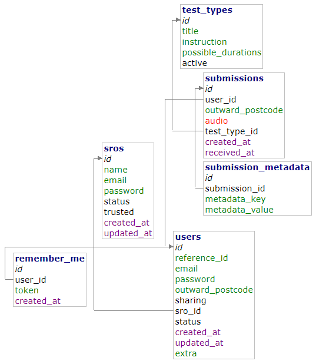

##### `remember_me`

| Column |	Type | Notes |
|--------|-------| |
| `id` |	int(11) unsigned Auto Increment	 | |
| `user_id` |	int(10) unsigned	| |
| `token` |	varchar(255)	| This is only a hash of the user's remember-me token. |
| `created_at` |	datetime [current_timestamp()] | |

##### `sros` (encrypted)

| Column |	Type |
|--------|-------|
| `id` |	int(11) unsigned Auto Increment	|
| `name` |	varchar(255) NULL	|
| `email` |	varchar(255)	|
| `password` |	varchar(255) NULL	|
| `status` |	tinyint(3) unsigned [0]	|
| `trusted` |	tinyint(3) unsigned [0]	|
| `created_at` |	datetime [current_timestamp()]	|
| `updated_at` |	datetime NULL |

##### `submissions` (encrypted)

| Column |	Type |
|--------|-------|
| `id` |	int(11) unsigned Auto Increment	 |
| `user_id` |	int(10) unsigned	|
| `outward_postcode` |	varchar(10)	|
| `audio` |	mediumblob NULL	|
| `test_type_id` |	int(11) unsigned	|
| `created_at` |	datetime	|
| `received_at` |	datetime [current_timestamp()] |

##### `submission_metadata` (encrypted)

| Column |	Type |
|--------|-------|
| `id` |	int(11) unsigned Auto Increment |
| `submission_id` |	int(11) unsigned |
| `metadata_key` |	varchar(255) |
| `metadata_value` |	text |

##### `test_types`

| Column |	Type |
|--------|-------|
| `id` |	int(11) unsigned Auto Increment	|
| `title` |	varchar(255)	|
| `instruction` |	text	|
| `possible_durations` |	varchar(255)	|
| `active` |	tinyint(3) unsigned [1] |

##### `users` (encrypted)

| Column |	Type |
|--------|-------|
| id	| int(10) unsigned Auto Increment	|
| reference_id	| varchar(32)	|
| email	| varchar(255) NULL	|
| password	| varchar(255) NULL |
| outward_postcode	| varchar(10) NULL	|
| sharing	| tinyint(3) unsigned [1]	|
| sro_id	| int(11) unsigned	|
| status	| tinyint(4) [0]	|
| created_at	| datetime [current_timestamp()] |
| updated_at	| datetime NULL	|
| extra	| varchar(255) NULL |

### Redis

Redis is an incredibly fast in-memory data store used in this project to store session data for both the app and the dashboard to avoid cluttering the database. In the future, it could possibly also handle remember me tokens (where keys have an `EXPIRE` set to automatically clear out expired tokens) as well.

## Data
### Export format

The dashboard may be used to export the data stored within the MariaDB database. It produces a ZIP file containing the following contents:
- a JSON file containing an array of submission metadata called `submissions.json`; and
- WAV files of patients' audio submissions named `submission_ID.wav` where
  - "ID" is the identifier of a submission detailed in `submissions.json` and
  - each audio file is encoded as a 16kHz 16-bit signed integer PCM WAV file.

For example, the ZIP file export comprising a single submission with an ID of 1 would contain both a `submission_1.wav` audio file, as well as a `submissions.json` file with the following contents:
```json
{
    "submission_id": 1,
    "reference_id": "000000000001",
    "outward_postcode": "SW1",
    "test_type_id": 1,
    "created_at": "2021-08-16T14:15:32.585Z",
    "received_at": "2021-08-16T14:19:07.766Z",
    "extra": "Additional information tied to this user supplied by their SRO.",

    "speech.syllableCount": "50",
    "speech.syllablesPerMinute": "300",
    "speech.wordCount": "31",
    "speech.wordsPerMinute": "186",
    "speech.duration": "10",
    "speech.transcription": "A record of what was said in the audio clip.",
    "sputum": "1",
    "wellbeing": "7",
    "dyspnoea": "1"
}
```

The first grouping of entries above contains submission and patient data common to all submission types, whereas the second grouping of entries contains submission metadata. These may either be generated by the app (e.g. those that start with `speech`) or self-reported scores input by the user, which are optional.

This format was designed to be flexible enough so that new analysis measures or more self-reported parameters may be more easily added in the future.

### Visualisation of results

#### Time series plots

Patients are shown a series of zoomable graphs for each of the metadata points gathered (e.g. syllable rate, sputum colour, MRC dyspnoea score and wellbeing), of which a selection is shown below. These graphs are also visible to SROs where patients have shared the submissions.

The graphs show a scatter plot of the metadata values with a solid grey line, representing the ['curve bundle'](https://github.com/d3/d3-shape#curveBundle) interpolation option in d3, which produces a straightened cubic basis spline.

Then, there is a solid green line showing the cumulative mean of the data (plotted using the cubic [Catmull-Rom spline](https://github.com/d3/d3-shape#curveCatmullRom) interpolation option available in d3). The idea of this line is to represent a 'ground truth' for each variable established as patients regularly submit data through the app over time.

Where appropriate, values presenting one cumulative standard deviation above or below the cumulative mean (depending on the variable) are shown as an orange dashed line, plotted in a similar way to the mean. It is interesting to see how this value narrows in closer on the mean over time as more data is collected to better establish the 'ground truth'.

Similarly, where appropriate, values repesenting three cumulative standard deviations above or below the cumulative mean are shown as a red line (with longer dashes).

This could potentially provide a foundation for future, more explicit nudging behaviour from the app.

The following graphs are from my own local testing (explaining the haphazard data):

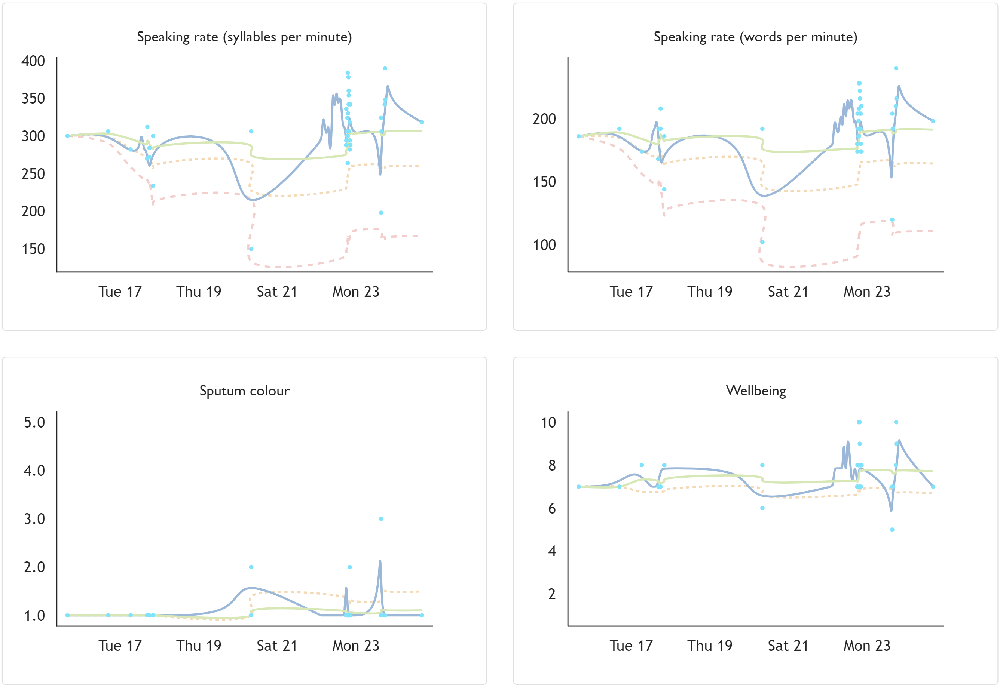

#### Syllable rate comparison graphs

While more in-depth data analysis would want to be performed outside the dashboard using the JSON data exported therefrom, I thought it would be nonetheless useful to provide zoomable visualisations of the various metadata plotted against syllable rate, along with a basic linear regression displayed over the points, in the dashboard to more easily determine how long the variables correlate with each other.

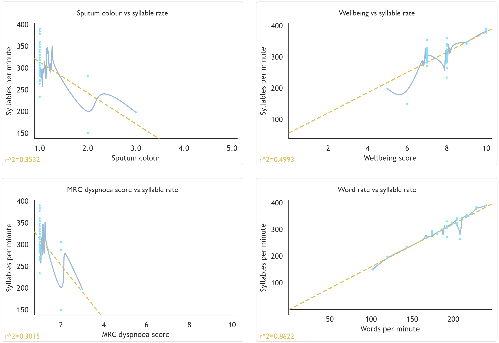

#### Metadata distribution graphs

In a similar vein, I also produce zoomable histograms showing the distribution of the numeric metadata produced, along with their corresponding box plots to aid data analysis.

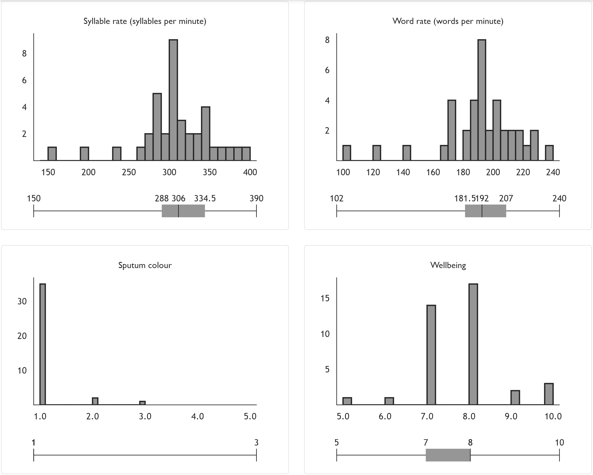

## Ideas for the future direction of the project

I have thoroughly enjoyed working on this project and while my student research internship was limited to only ten weeks over the summer, I thought I would list a few ideas as to where this project could go, should anyone be interested in contributing to it.

- **Web APIs to use** potentially when they become sufficiently mature (i.e. when Safari updates):
  - [Background sync API](https://developers.google.com/web/updates/2015/12/background-sync)
    - This would be to allow offline submissions to be pushed when users regain internet access.
    - If this is implemented, the authentication system might have to move away from sessions towards something more token-based.
  - [Notification Triggers](https://web.dev/notification-triggers/) as part of the [Web Notifications API](https://notifications.spec.whatwg.org/)
    - This would be so that the app may schedule notification reminders with the operating system.
    - This may be useful to remind users regularly to create a submission or nudge them when their syllable rate data becomes more heteroscedastic and they ought to book an appointment with their doctor.
  - [Web Authentication API](https://developer.mozilla.org/en-US/docs/Web/API/Web_Authentication_API)
    - When support is more widespread, I would love to see fingerprint authentication for this app. The keys generated could potentially be used to encrypt the IndexedDB records at rest on the device in a similar way to how they are encrypted on the server.
  - navigator.mediaDevices [Permissions API](https://developer.mozilla.org/en-US/docs/Web/API/Permissions_API)
    - At the time of writing, this is unsupported in Safari. This would make it so that the app could ask for permission to use the user's microphone without having to immediately open the audio stream then and there.
  - [MediaRecorder API](https://developer.mozilla.org/en-US/docs/Web/API/MediaRecorder)
    - This would be nice to use instead of RecordRTC when there is support from major browsers for both recording directly to WAV and resampling. I would very much like to move away from relying on a library that uses `ScriptProcessorNode` internally.
- **Improvements**
  - Other visualisation libraries (e.g. [visx](https://airbnb.io/visx/)) and strategies could be trialled to see how the user experience could be improved from both the perspective of patients and of senior responsible officers.
  - The Kaldi model could be pruned further to a smaller size once there is greater clarity surrounding the specific speech researchers are interested in studying, rather than this generalist model.
  - While UK postcode area data is collected, it would be nice if this data could be visualised geographically.
  - More analysis could be performed locally on the audio data, for example, perhaps the [voice activity detector from WebRTC](https://github.com/mozilla/webrtcvad_js) or a library such as [hark](https://www.npmjs.com/package/hark) could be used to gather a measure of phonation time.
  - Potentially, more self-reported health data could be gathered if deemed appropriate, or the self-reported data in question could be configurable in the dashboard.
  - Other statistics could be experimented with, for example using the [median and median absolute deviation method (MAD)](https://docs.oracle.com/cd/E17236_01/epm.1112/cb_statistical/frameset.htm?ch07s02s10s01.html) for establishing a ground truth for syllable rate instead of the mean and standard deviation method.
- **Additional features**
  - Exporting data and audio from the app
  - Restoring data (and audio?) from the server
  - Withdrawing all/particular submissions from the server
  - A 'save space' tool to delete submission audio (or entire submissions) to reduce the storage footprint of the app
  - Account deletion
  - Transferring individual patients to other SROs
  - More explicit nudging behaviour
